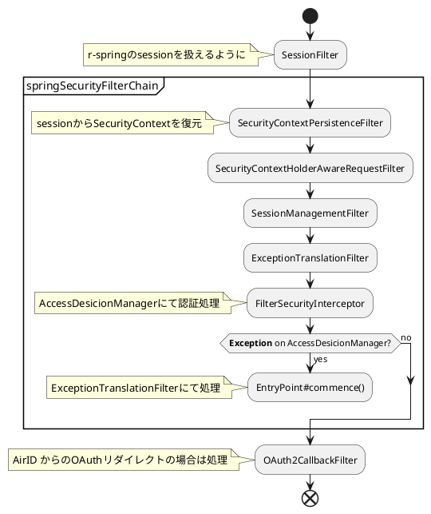
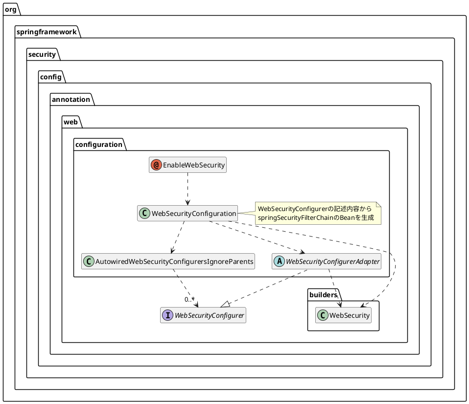

# 各Filterの役割整理

## 重要Filter
重要Filterを抜粋
下記の順に登録する必要がある。
(springSecurityFilterChainの中は勝手に登録される)

### 1. SessionFilter
r-spring-sessionで定義されたもの
- requestを`HttpSessionServletRequest`でラップする
  - `RSpringSession`を`request.getSession()`で取れるようにする

### 2. springSecurityFilterChain
Spring Securityによって作られるFilter群
#### 2-1. SecurityContextPersistenceFilter
- `SecurityContext`があれば復元（デフォルトだと`HttpSessionSecurityContextRepository`が使われるため、Sessionから復元）
- finallyで`SecurityContext`を保存（同様にデフォルトだとsessionに保存）

#### 2-2 SecurityContextHolderAwareRequestFilter
- `request`を`SecurityContextHolderAwareRequestWrapper`でラップする

#### 2-3. SessionManagementFilter
- 既に`SecurityContextHolder`があれば`SessionAuthenticationStrategy`により認証処理

#### 2-4. ExceptionTranslationFilter
- これ以降(実質次の`FilterSecurityInterceptor`)で発生したExceptionをハンドリングし、`AuthenticationException`か`AccessDeniedException`であればConfigで登録した`EntryPoint`へ遷移

#### 2-5. FilterSecurityInterceptor
- 内部に持つ`AccessDesicionManager`で認可判断
  - `hasRole()`とかした場合は内部の`WebExpressionVoter`が判断

### 3. OAuth2CallbackFilter
ABO内で定義 (将来的にr-springに寄贈?)
- `issueToken`
- `token/check`
- サービス利用状況
- `PlfOAuth2CallbackFilter#authorize()`
  - `PlfTokenAuthenticator#authorize()`
    - `generateModel()`で`AuthedModel`作成
    - `setAuthenticated()`で`Authentication`作成、`SecurityContext`に保存
      - `generateAuth()`で`Authentication`作成

## Spring SecurityのFilterの登録の流れ
spring Securityによって作られる`springSecurityFilterChain`というbeanが作られる
- `@EnableWebSecurity`を設定
- `WebSecurityConfigurer`を継承した設定クラスをbean化する

## 参考URL
* [spring-projects/spring-security: Spring Security](https://github.com/spring-projects/spring-security)
* [Hello World で学ぶ Spring Security の仕組み - Qiita](https://qiita.com/opengl-8080/items/d4971ec4d2365c85ff99)
* [Spring Security 使い方メモ　認証・認可 - Qiita](https://qiita.com/opengl-8080/items/032ed0fa27a239bdc1cc)
* [SessionManagementFilter の価値がようやくわかった気がする - 舞台裏](http://opengl-8080.hatenablog.com/entry/2017/04/21/001307)
